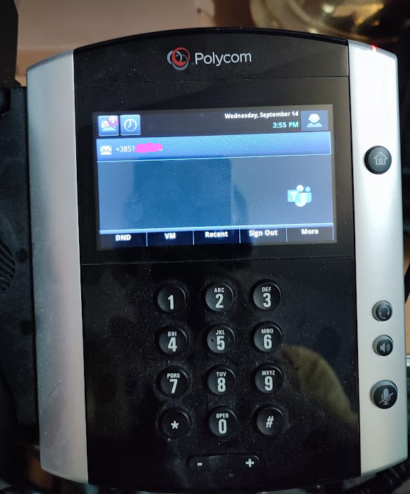

Few months ago I've been asked to evaluate interesting project where customer had more than 800 Poly VVX phones. That's a quite an investment if you ask me. So, long story short these phone can work in two modes SIP and SfB. Since SfB is fading away this hardware could be recycled by registering it to [Microsoft SIP Gateway](https://docs.microsoft.com/en-us/microsoftteams/sip-gateway-plan). To do so you must provision custom image to phone (not all models are supported check for list of suppored hardware first).

Steps to register phone to MSFT SIP GW are straight forward and it's not a an issue. Whole process takes about 3-4 minutes.Problem occurs with volume of devices to update. Other challenge is when you think how to centrally manage these phone. Yes, there are tools that can do this for you. But what if the ask is if you can be precise and do a staged migration group phones by location and not full cutover?

Well this is where we come to the point of writing this article. I ran into interesting project written by James Cussen named [Poly-VVX-Teams-SIP-Gateway-Tool](https://github.com/jamescussen/Poly-VVX-Teams-SIP-Gateway-Tool). 
{: .mx-auto.d-block :}.

It looked promising but I had get sample phones. So, I managed to get Poly VVX 500 and 600 for my test. Here's a photo how it looks like when Teams image is provisioned.
{: .mx-auto.d-block :}. 

PowerShell tool was working spot on. There was a glitch in GUI which James quickly mended. I was really impressed on how tool worked. POC went fine, I will update article when mass migration actually starts, so far so good, exactly what I was looking for. Thank you James!

