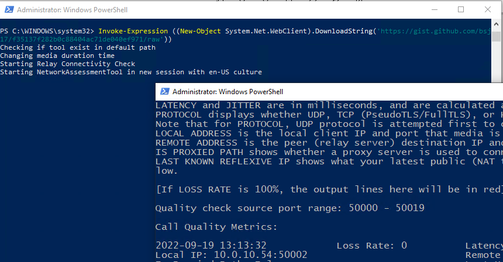

So, you need to start with multisite network assesment to see what's coming at you. Old SfB network assesment still works (gives more forgiving results) but you want to use latest available tool. Before giving instructions to customer you want to test it out. Right?

All looks good, and then you want to import your data in Excel for analysis. Results are showing bit off. 

| Result |Timestamp-UTC | LossRate-%| AverageLatency-Ms |AverageJitter-Ms|Protocol | LocalIP | RemoteIP | ProxyUsed |ReflexiveIP |
|:------ |:------ |:------|:------|:------|:------|:------|:------|:------|:------|
|<span style="color:green">Valid</span> |2022-06-08-08:14:13 | 0|66.93|72.16| UDP|10.0.10.52:50019| 52.114.254.107:3478| False| 31.45.200.124:50019
|<span style="color:red">invalid</span> |2022-06-07-08:54:26|0|75|69|95|32|UDP|10.0.10.52:50013| 52.114.231.159:3478 (and it's broken...)| False|31.45.200.124:50013

Closer look shows that decimal point and separator are the same. Bummer! You got a problem (if you're not in US). Surely this wasn't the case on SfB Network Assesment tool.

You read a documentation and there's no record that you can parametrizse this detail regarding separtors. 


Googling shows few [Microsoft forums](https://docs.microsoft.com/en-us/answers/questions/562201/network-teams-assessment-tool-csv-format.html) where users complain about this but nobody gives a resolution to this challenge

So, only thing that actually works is changing your windows culture in Powershell terminal and starting tool from that process. Again, it's not a problem if you're doing it on your machine and customer is skillful enough to do all the steps right.

I made small script, nothing fancy it will do following:

- Download the Teams Network Assessment tool and installs it silently
- Setup 2 firewall rules (so it doesn't prompt user)
- Change appSettings to extend duration of test to 65535s or max 18 hours (developers used UInt16 so you can't go above this)
- Execute relay connectivity and media tests
- Check relay connectivity should be successful in order to continue with media test. 
- If connectivity fails it will not continue (consult your network/firewall team check this [URL](https://docs.microsoft.com/en-us/microsoft-365/enterprise/urls-and-ip-address-ranges?view=o365-worldwide#skype-for-business-online-and-microsoft-teams) for details on targets).
- Open Explorer where results are generated

So, all person needs to do is to send the result back for analysis.

If you want to test it out, code can be found on [my gist](https://gist.github.com/bsj17/f35137f282b0c88404ac71de040ef971).

To execute above steps simply open Windows PowerShell as admin and paste the following code
```powershell
Invoke-Expression ((New-Object System.Net.WebClient).DownloadString('https://gist.github.com/bsj17/f35137f282b0c88404ac71de040ef971/raw'))
```
_Sample of tool in action_
{: .mx-auto.d-block :}. 

Yes, I know this could've been written more nicely. But it does what it needs and I already completed my analysis :-).