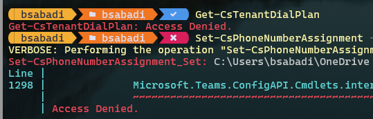

New MicrosoftTeams 4.7.1-preview Module was released recently. Microsoft has finally implemented Application-based authentication! This is a great news since we're all turning to ModernAuth and BasicAuth slowly fading away. 

I bet all your ExchangeOnline scripts are already updated to use [App-only authentication](https://learn.microsoft.com/en-us/powershell/exchange/app-only-auth-powershell-v2?view=exchange-ps) for unattended scripts. Right? Well if they are not, make sure you do that unless it's too late since counter is already started.

Unfortunately, with this release it's too early update Teams automation scripts. After testing I can confirm that module does what it say's in docs. It's a prerelease and it's lacking lot of cmdlets that one would likely need when writing automation. For now, new [authentication method](https://learn.microsoft.com/en-us/MicrosoftTeams/teams-powershell-application-authentication) and few cmdlets listed in article:

{: .box-note}
**Note:** 
"All Non *-Cs cmdlets (for example, Get-Team), Get-CsTenant, Get-CsOnlineUser & Get-CsOnlineVoiceUser are already supported. Other cmdlets will be gradually rolled out."

If you try other *-Cs cmdlets not listed above you'll get "Access Denied" error.

{: .mx-auto.d-block :}
Thanks for reading.