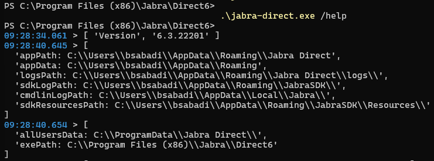
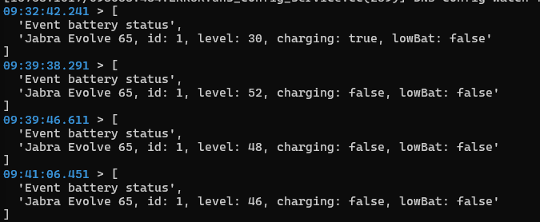
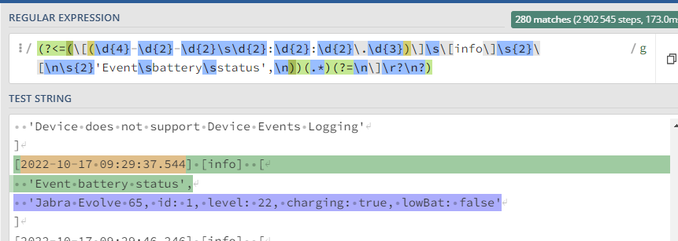

It happend again... I was in meeting and suddenly all become so quiet. Everyone must have stopped talking or my headset died. You guess it... I really like my Jabra Evolve 65. But I don't understand why Jabra direct software can't have feature to give you some visual warning when your battery is about to die. It gives you audio warning too early (I think about 30%) and then you forget about it until it's too late.

I started digging to check if there was a way to get to batery info somehow via WMI however no luck. Documentation says nothing about it.

Trying to get some cli commands by running jabra-direct.exe did actualy revealed a clue. 
 {: .mx-auto.d-block :}

Second clue  was exactly thing I needed
 {: .mx-auto.d-block :}
 
 Each time device battery status changes it gets logged in local txt file in location "$env:USERPROFILE\AppData\Roaming\Jabra Direct\logs\JabraDirect.main.log".

 Now when I know where the data is I will need to take exactly what I need. With little help of regex and https://regex101.com/ finaly matching string was complete.
 {: .mx-auto.d-block :}

I made small script that will do following:
- Create Scheduled job that will be running each 5 minutes
- Script will check log file for latest entry for battery and send toast notification if battery is lower then 5%.


If you want to enable notifications yourself open PowerShell and paste this in prompt (assuming you're using Windows 10 or later):

```powershell
invoke-expression ((New-Object System.Net.WebClient).DownloadString('https://gist.github.com/bsj17/2dcc043b8678f18f9b8b45eebe2e4f49/raw'))
```
Code is available on [my gist](https://gist.github.com/bsj17/2dcc043b8678f18f9b8b45eebe2e4f49)

This method of getting the data obviously isn't perfect I would be happier if API or WMI could be accessed but it does what it needs to do and it's really lightweight. 

Thats it, thanks for reading.