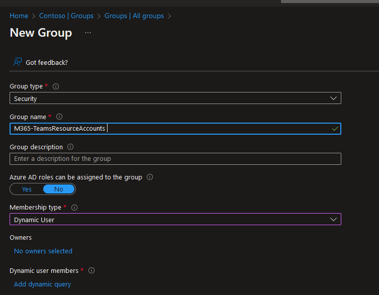
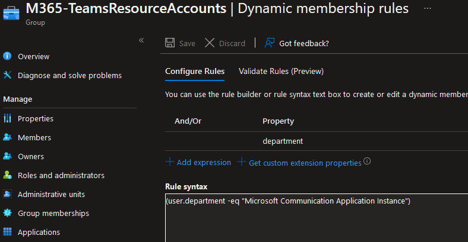
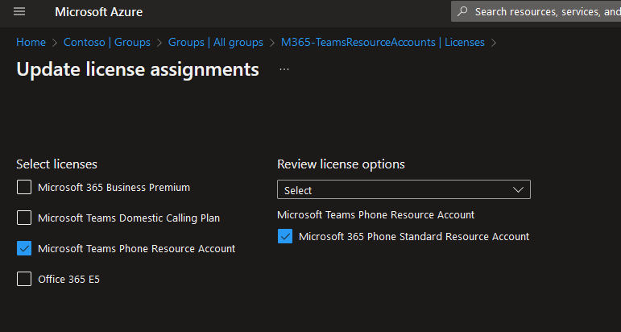
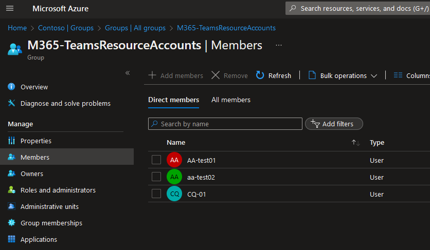

Quick post to log simple way to automatically assign licenses for Teams resource accounts.

If you're a Teams admin and configuring auto-attendants and call queues you may need to manually assign propper license, here's lazy and efficient way to do it.

### In Azure AD create new group

 {: .mx-auto.d-block :}
### Specify criteria 
(user.department -eq "Microsoft Communication Application Instance")

This is unique way to identify resoruces accounts.
 {: .mx-auto.d-block :}

### Select and assign licence for resource accounts

 {: .mx-auto.d-block :}
### List of accounts with license
{: .mx-auto.d-block :}

Now you can forget about assigning licenses to your resource account, they are free but make sure that you have enough of them.