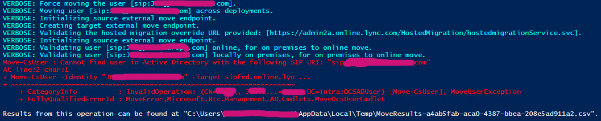

## Intro
During SfB to Teams migration in multi-domain AD environment I ran into error a bit missleading at quick glance. Error says can't find user, while Get-CsUser is able to find it... {: .mx-auto.d-block :}After consulting my favorite search engine it turns out that error is clearly documented under slightly different wording "[You cannot move users from a different AD domain in hybrid Skype for Business Server to Skype for Business Online](
https://learn.microsoft.com/en-us/skypeforbusiness/troubleshoot/hybrid-move-sfb-online/cannot-move-users-from-different-ad-domain)".

Solution is straightforward, specify DomainController parameter with FQDN of DC matching user object originating domain.

For example user "jdoe@contoso.com" is member of domain "hu.contoso.intra". I could manually look for writable DC in target domain and then specify needed parameter and command would look like this:
```powershell
Move-CsUser -Identity "jdoe@contoso.com" -Target sipfed.online.lync.com `
-Credential $(get-credential) -HostedMigrationOverrideUrl "https://admin2a.online.lync.com/HostedMigration/hostedmigrationService.svc" `
-Confirm:$false -Verbose `
-DomainController hupdc01.hu.contoso.intra
```
## Challenge
Depending on how input batch migration schedule looks like, one could do the grouping by domain first and point to appropriate DC. However reality is different story. Batches are dictated by business, so it's necessary to make life easier during migrations and figure out way to identify respective DC FQDN on-fly.
## Solution
As always starting small and building-up toward solution is way to go. Check output of Get-CsUser in SfB PoSh console to see if there's something useful already built-in. Bunch of attributes but nothing that would be usable, only DistinguishedName looks as it could yeld some result. 

If you're new to AD and LDAP you may wonder what DistinguishedName (or DN for short) is. If you want to know more check [this](https://learn.microsoft.com/en-us/previous-versions/windows/desktop/ldap/distinguished-names) out. For now let's just look at it as a string telling us location of object I.E. "CN=jdoe,OU=HappyUsers,DC=hu,DC=contoso,DC=intra". This is interesting because AD domain DNS name can be constructed by taking DC (domainComponent) segment and concatenate it together and then query ADDS to get list of writable DC's.

With a help of RegularExpressions and https://regex101.com/ for visualization let's extract domain name from our strings. For example "DC=hu,DC=contoso,DC=intra".
{: .mx-auto.d-block :}

And then remove "DC=" and replace comma with dot and domain name is here. 
With that we can get FQDN of PDC used later on in script. 
```powershell
(Get-ADDomainController -DomainName hu.contoso.intra -Service "PrimaryDC" -Discover).HostName
```
Assembling helper function:
```powershell
function Get-DCFromDN ($dn)
{
    <#
        .SYNOPSIS
        Extracts domain DNS name from DistinguishedName and get's PDC in target AD. 
        .DESCRIPTION
        Extracts domain DNS name from DistinguishedName and get's PDC in target AD. Function depends on ActiveDirectory module.
        .PARAMETER dn
        Specifies DistinguishedName.
        .EXAMPLE
        PS> Get-DCFromDN -dn "CN=jdoe,OU=HappyUsers,DC=hu,DC=contoso,DC=intra"
    #>
    $dc = [regex]::Match($dn,"DC=.*") -replace "DC=" -replace ",","."
    (Get-ADDomainController -DomainName $dc -Service "PrimaryDC" -Discover).HostName
}
```
### Putting it all together
```powershell
#fill migration account creds
$cred=Get-Credential  

#region Validate batch input data
$users = Get-Content .\20221109-migration.txt
$failed =@(); $ok = @()

foreach ($user in $users) {
    try {
        $ok += Get-CsUser -Identity $user.trim() -ErrorAction stop | select userprincipalname,HostingProvider,lineuri,name,RegistrarPool,@{l="DC";e={Get-DCFromDN -dn $_.DistinguishedName}}
    }
    catch {
        Write-Host "Failed: " + $user.trim()
        $failed += $user.trim()
    }
}
#endregion

#region Start Migration
$migrationbatch= $ok | where HostingProvider -EQ "SRV:"

$migrated=@(); $migfailed=@()

foreach ($u in $migrationbatch){
    try {
        $url="https://admin2a.online.lync.com/HostedMigration/hostedmigrationService.svc"
        Move-CsUser -Identity $u.UserPrincipalName -Target sipfed.online.lync.com -Credential $cred -HostedMigrationOverrideUrl $url -Confirm:$false -Verbose -ErrorAction Stop -DomainController $u.dc
        $migrated += $u.UserPrincipalName  
    }
    catch {
        $migfailed+= $u
        Write-Host "failed moving: " + $u.UserPrincipalName
    }
}
#endregion
```

That's it for today. Long post for such tiny function. Thanks for reading!