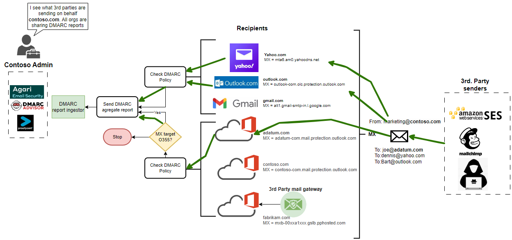
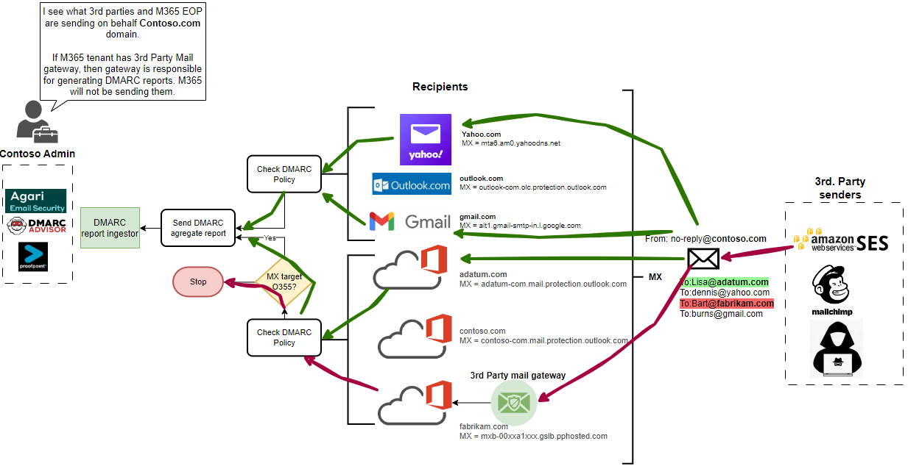

## Intro

During late March of 2023. M365 tenants started to sending DMARC reports according to Microsoft 365 Roadmap ID 109535. More details can be found at [MC516348 — DMARC aggregate reports for enterprise](https://techcommunity.microsoft.com/t5/public-sector-blog/march-2023-microsoft-365-us-public-sector-roadmap-newsletter/ba-p/3770486#:~:text=MC516348%20%E2%80%94%20DMARC%20aggregate%20reports%20for%20enterprise).

Kudos to Microsoft for doing so and making an internet safer place.
## Devil is in details
If you read details of article there is a catch: 
<em>"DMARC reports are only sent to domains whose MX is pointed to O365. In order to obtain DMARC aggregate reports for your domain, it must have a valid DMARC record that includes a valid RUA email address."<em>

 ** Update **
I received a valuable feedback and article needs to be updated.

In the message centar there is an [update](https://portal.office.com/adminportal/home?ref=MessageCenter/:/messages/MC516348)
giving more details: 

<em>"For example, you have mailboxes with the recipient domain contoso.com, which domain has it's MX record pointed directly to Office 365. (contoso-com.mail.protection.outlook.com). In this scenario Office 365 will automatically send DMARC aggregate reports to all email sender domain owners which has a valid RUA address defined in their domain DMARC record. 

If contoso.com MX record pointed to a different email security solution in front of Office 365, Office 365 will not send DMARC aggregate reports to any sender domains RUA address configured in their DMARC record as the information we see about the sending infrastructure is likely to have been affected by the complex mail flow routing."<em>

This is a bit contradictive to first announcement which essentially says "M365 will not sending DMARC report to M365 tenant with 3rd party mail GW"
## But what does this mean in real life?

First you need to know a little about of:
- [What is DMARC?](https://dmarc.org/#:~:text=Search%E2%80%A6-,What%20is%20DMARC%3F,-DMARC%2C%20which%20stands)
- [How is it used?](https://dmarc.org/wiki/FAQ#Why_is_DMARC_important.3F:~:text=they%20are%20received.-,How%20does%20DMARC%20work%2C%20briefly%2C%20and%20in%20non%2Dtechnical%20terms%3F,-A%20DMARC%20policy)
- [What problem is it solving?](https://dmarc.org/wiki/FAQ#Why_is_DMARC_important.3F:~:text=fail%20DMARC%20evaluation.-,Why%20is%20DMARC%20needed%3F,-End%20users%20and)

For each received email message DMARC policy is evaluated and aggregate report is being sent periodically to domain owner according specified RUA address in DMARC DNS record.  
For example:
"_dmarc.microsoft.com    
text =
        "v=DMARC1; p=reject; pct=100; rua=mailto:itex-rua@microsoft.com; ruf=mailto:itex-ruf@microsoft.com; fo=1""

With parsing these aggregate reports, which are XML files as this  [sample](../assets/img/2023-04-19-M365DMARCChange/dm_emPz0toVbG.xml)  from M365 (Enterprise Outlook) organization can get very accurate picture on how "Internet" sees their SMTP domain and distinguish what is legitimate traffic, legitimate unaligned and malicious traffic as well.

There are many of vendors offering platform that ingest DMARC reports and translate them into valuable sources of information.

For example I'll highlight my top 3: 
[DMARC Advisor](https://dmarcadvisor.com/) 
[ProofPoint EFD](https://www.proofpoint.com/us/products/email-protection/email-fraud-defense) 
[Agari](https://www.agari.com/solutions/email-security/dmarc)

## Reporting
Let's get back to afore mentioned [detail](#devil-is-in-details).

To make it more visually understandable I drew diagram showing 2 cases. For sake of simplicity I created two groups. 3rd party senders and Recipients. 

3rd party senders: Commonly used 3rd party sending email services for such Amazon SES and Mailchimp plus malicious actor.

Receivers (are also senders) such as Yahoo, Gmail, Outlook.com and M365 tenants.

### M365 Sending DMARC report

** Update **
### M365 not sending DMARC report if 3rd party mail GW is in-front of EOP

## Conclusion

It's a great improvement that M365 as world biggest mail provider is finally sending DMARC reports. So, it's up to the 3rd party mail gateway vendors to close the gap and start sending DMARC reports from their side (Yes, ProofPoint I mean you). 

Thanks for reading!